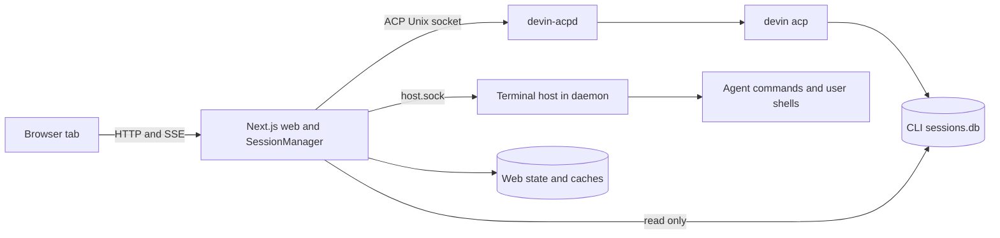

# Architecture

Devin CLI speaks ACP over JSON-RPC. devin-web translates it into a browser experience and combines live events with CLI-owned durable history. The recommended Linux deployment separates the web server from agent and terminal lifetime.

`proxy.ts` and `lib/security/requestGuard.ts` enforce Host/origin/header checks. This is a single-user local authority model; an authenticated remote-access layer is external. The web uses ordinary Next.js Node routes, not a static export or edge-only deployment.

## Processes and ownership

- `bin/devin-web.mjs` validates startup and launches Next.js. `bin/devin-web-ctl` manages Linux process groups and the exported environment.
- `bin/devin-acpd.mjs` and `lib/acp/daemon.mjs` own one `devin acp` process in managed mode. The web connects through `lib/acp/transport.ts` and `bridge.ts`.
- `lib/acp/host.mjs` owns PTYs inside the daemon. `terminal.ts` selects the local pool or `terminal-remote.ts` according to host-socket configuration.
- `lib/acp/manager.ts` owns session runtime and queues; `sessionView.ts` owns versioned views; `turnRegions.ts` owns transcript-region lifecycle.
- `bin/devin-web-watch.mjs` supervises the web. It respects intentional stops and does not make a daemon restart harmless.

Standalone mode spawns the agent in the web's lifetime. Managed mode survives a web restart because the daemon and host process group stays alive. This does not protect against a daemon restart, OS shutdown, or host failure.

## The authoritative session view

Each tab has a multiplexed SSE connection (`lib/stream/connections.ts`). Subscriptions include session `view`, durable `transcript`, terminal output, and global events.

A new view subscriber receives one authoritative snapshot of metadata and regions. Reconnecting with a cursor inside the bounded patch log can receive only contiguous missed patches; an evicted cursor or a version gap requires a new snapshot. A client commits a patch only at `v === have + 1`, ignores stale versions, and replaces metadata and regions together on snapshots. A new server epoch invalidates stale client requests and cursors.

Metadata comes from `reduceEvent`; new keys must be added to `META_KEYS`, and restart-persistent keys to `PERSISTED_META_KEYS`. Removal uses explicit `clearMeta`, because JSON omits `undefined`. Content assembly belongs to the server's item assembler, not to metadata reduction or browser text matching.

The separate transcript subscription provides durable commits and older pagination. Those replies extend durable rows only within the current watermark; they cannot replace authoritative retained state. Results from an old session, epoch, or replaced snapshot are discarded.

View patches and transcript deltas can arrive separately at a turn boundary. The browser tracks the transcript's acknowledged raw `lastId` independently of the view's `durableThrough`. It keeps the last coherent rendered regions until the new watermark has been delivered, and holds early rows above the watermark for the corresponding view patch. Filtered-only commits still send an empty delta with their completion cursor. A stalled delivery requests a fresh view snapshot after two seconds; this deadline triggers recovery, rather than suppressing integrity alarms. Once delivery completes, anchors beyond the delivered durable tail still report `orphanAnchor`. An empty, untruncated snapshot also proves missing anchors; an empty truncated tail does not, because its anchors may belong to older history.

## Regions, identity, and finalization

The displayed conversation consists of four inputs:

1. **Durable** rows from CLI `sessions.db`, keyed by `message_id`.
2. **Provisional** items assembled from the running turn, with server-assigned identities.
3. **Retained** thoughts/plans that have no durable counterpart, attached to durable anchors.
4. **Overlay** notices and request fallbacks from `items`.

The browser applies region order and upserts exactly; it must not infer identity from equal text. Repeated prompts and repeated tool output are legitimate. A provisional item revision changes when its sequence or completion, resolution, or anchor changes; unchanged objects can be reused.

At turn completion, durable user/agent/tool rows replace the provisional spine. `alignSpine.ts` matches tools by exact tool IDs and text by role ordinal, then anchors counterpart-less items within that turn's range. Retained items appear immediately after their anchors, with a 20-turn bound in memory and `itemlog.db`. They travel on turn flips, snapshots, and transcript responses; an omitted retained field on an ordinary flush means keep the prior list.

Permission/question requests enter assembly at arrival, resolve on their completion event, and remain answerable until resolved. Overlay duplicates are suppressed. Resolved cards retire at turn boundaries; final tool states reconcile previously open cards with newer item revisions.

## Frozen durable watermark

`durableThrough` freezes when a running turn starts, including adoption after a web restart. Mid-turn CLI commits stay hidden from the durable region while provisional items describe the same work. At completion, durable coverage advances the watermark and clears the provisional spine. Without the boundary, the browser can show content twice or move thoughts below their own turn.

The durable seed follows canonical transcript geometry, including compaction roots and grafted branches. A graft crossing the frozen watermark is kept internally to discover eligible earlier history, then clipped before display. Nested grafts must never leak rows above the watermark. Explicit head, branch, segment, and pagination cursors have distinct scopes and must remain distinct.

## Restart and resumption

The daemon tracks loaded sessions and buffers relevant traffic while the web reconnects. Before an initialized web client is ready, the daemon can handle the agent's text-file requests itself; later it forwards them. Permission/question forwarding has bounded disconnect handling, so web downtime is not an unlimited pause guarantee.

A restarted web adopts already-live sessions. **Do not call `session/load` on a live daemon-adopted session to populate its UI**: that can disrupt its turn. Seed the view from metadata, itemlog, frozen durable history, and current runtime; fetch older history through transcript pagination.

Provisional updates persist best-effort in `itemlog.db`; finalization writes the latest assembler snapshot and retained selection in one transaction. Alignment or finalization failures preserve the old region for retry. ACP completion and the CLI database commit are independent: an ended region containing agent content must also wait for durable progress before a new turn replaces it. Empty regions and user-echo-only endings can retire without a commit. A subsequent prompt stays in the persisted queue until the previous region can finalize. Retries run independently of browser traffic, use backoff, and preserve queue identities and order. If durable progress never arrives, the old region stays recoverable and the UI explains how to retrieve the queued prompt or continue in a new session; an error/cancel response is not proof that no later commit can arrive. Boot-scoped turn IDs prevent a new process from modifying a dead turn. Before new event sequences are allocated, restore logged regions and floor the local sequence above their saved `seqTo`. View versions are a separate number space.

The prompt queue persists in `prompt-queue.json`; larger attachments live in `queue-blobs/`. Hydrate it before draining. Queue edits/removals update ghost bubbles; the actual user bubble comes from assembly when a prompt drains. Session deletion pauses draining, clears state on success, and preserves/resumes it on failure. Late completion of a deleted session cannot revive a replacement session with the same identifier.

## Terminal transport

The daemon host accepts `term/*` NDJSON RPCs. Attach returns a scrollback snapshot with absolute byte offsets; reconnect skips already-consumed output. Delayed RPC replies belong to the requesting socket, never its replacement. Backpressure pauses the upstream writer and installs one drain listener per socket; losing a socket releases its paused upstream.

The host also sends session liveness and database-change notifications. The web sends `sessions/state` on every host connection so the client is adopted even when no terminal is open. Passive liveness checks use pid/status files; an active socket probe can displace the current client.

## Database boundaries

`lib/db.ts` opens CLI `sessions.db` read-only and closes handles in `finally`. Session mutation goes through ACP. Archive state lives in web-owned `archive.json`; the CLI's `hidden` column is only a read-only mirror. Settings can revoke allow rules by carefully updating the separate CLI configuration file; that exception is not permission to write the sessions database.

`search.db` is a derived FTS/search and aggregation cache. `treecache.db` indexes parent relationships. Cache identity uses `(session_id,node_id)` while source row IDs are catch-up cursors. Source replacement, rewrites, and main-chain changes require invalidation. Heavy aggregate work belongs in the cache loop rather than request-time CLI DB scans.

Schema health fingerprints required CLI tables/columns and distinguishes compatible, drift, and unavailable. An unknown migration version is different from missing required columns. CLI compatibility is observed through schema/capability checks, not assumed from a product name.

See [decision notes](decision-notes.md) and [AGENTS.md](../AGENTS.md) for contributor invariants, and [operations](operations.md) for safe deployment and storage recovery.
